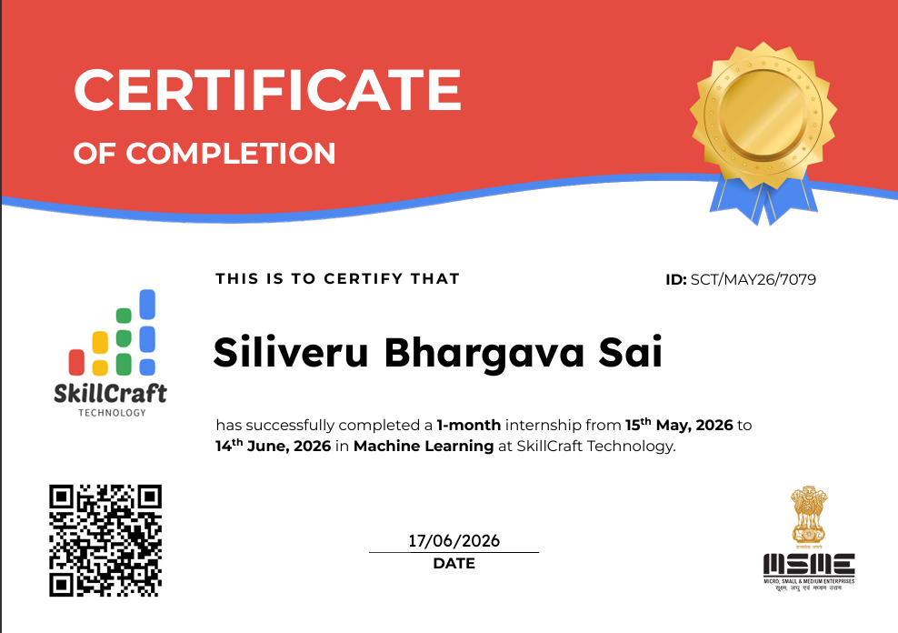

# Certificates

# My Certifications

This repository contains my professional certifications and internship certificates.

## Certifications

### 1. Machine Learning Internship - SkillCraft Technology
- Duration: 15 May 2026 – 14 June 2026
- Domain: Machine Learning
- Status: Completed ✅

## 🚀 Projects Completed

### SCT_ML_1
- Population Segmentation using K-Means Clustering

### SCT_ML_2
- Customer Purchase Prediction using Machine Learning

### SCT_ML_3
- Cat vs Dog Image Classification

### SCT_ML_4
- Hand Gesture Recognition using CNN

- [SCT_ML_1 Repository](https://github.com/bhargavasaiii17-svg/SCT_ML_1)
- [SCT_ML_2 Repository](https://github.com/bhargavasaiii17-svg/SCT_ML_2)
- [SCT_ML_3 Repository](https://github.com/bhargavasaiii17-svg/SCT_ML_3)
- [SCT_ML_4 Repository](https://github.com/bhargavasaiii17-svg/SCT_ML_4)

## 🛠️ Skills Gained

- Python
- Machine Learning
- Data Preprocessing
- Data Analysis
- Data Visualization
- Model Training
- Model Evaluation
- Deep Learning
- Computer Vision
- 

## 🎓 Machine Learning Internship - SkillCraft Technology

Successfully completed a 1-month Machine Learning Internship.

### 📜 Certificate

